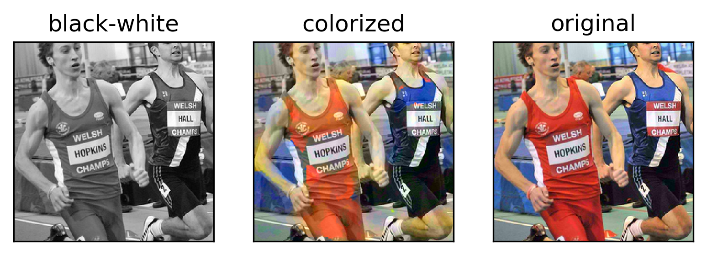
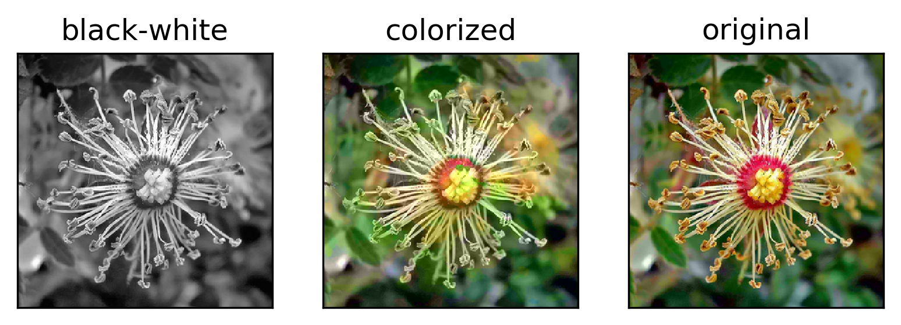
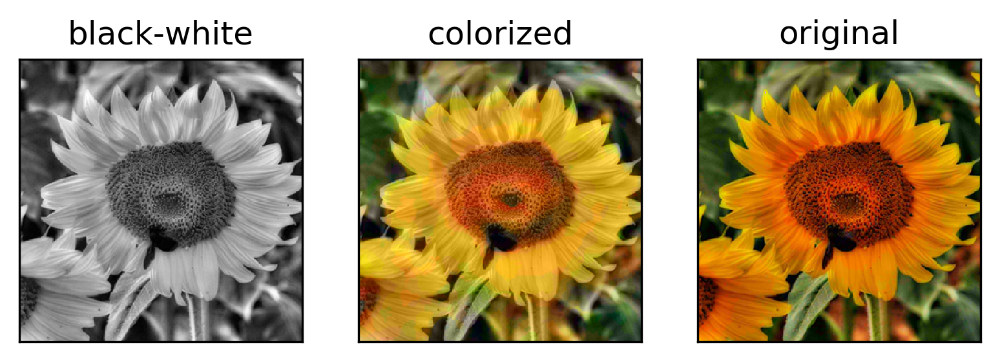
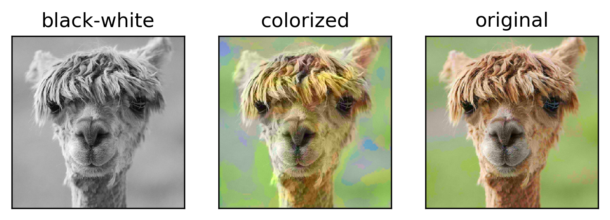
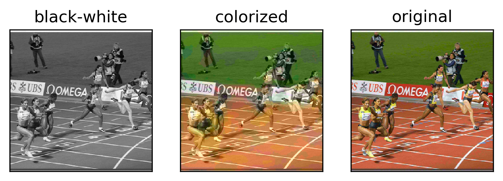
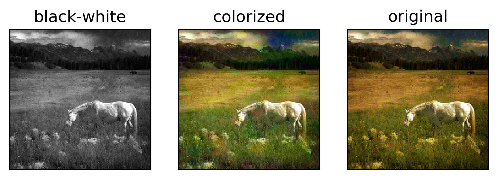
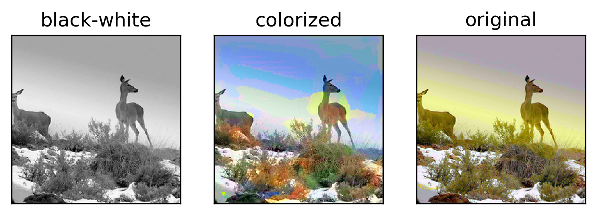
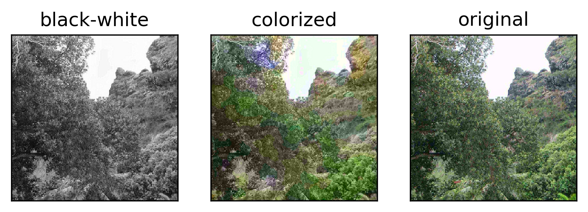

# ColorNet

A convolutional neural network for colorizing black white pictures inspired by: [https://arxiv.org/abs/1603.08511](). This implementation is based on Keras and Tensorflow.

The net consists of 8 subsequent convolutional blocks, each consisting of 2 convolutional layers using leaky ReLU, one Dropout Layer and one Batch Normalization Layer. There are approx. 12,8 Millon trainable parameters.

There are 5 downsampling blocks, the first of them are bisecting the widht and height of the image by using a stride of 2 in the last convolutional layer. At the same time, the number of filters in increased each time. The last 2 blocks are upsampling blocks that double the size of the inputs while at the same time reducing the number of filters (see [model.png](model.png) for the exact architecture).

## How to use

The trained version of the network can be downloaded [here](https://drive.google.com/file/d/12Mu55od-CUZN0IiUZPSIyMs8wolytqGv/view?usp=sharing).

Because of limited hardware resources (no GPUs), the model has been trained on only 1024 images from the ImageNet Dataset. Traing was executed on a Google Compute Engine VM for approx. 3 days. (approx 150.000 epochs). It does not generalize very well on images it has never seen before.

To use the model, first place the weigths file (`cp.h5`) into the `/model/checkpoints` directory.

For applying the model to an image of your choice, run
```bash
python3 colorize.py -image myimage.jpg
```

## Examples

Here are some images from the ImageNet dataset for which the algorithm worked especially well:











## Negative Examples

While the Net performs quite well on some images, there are also some it fails on:





